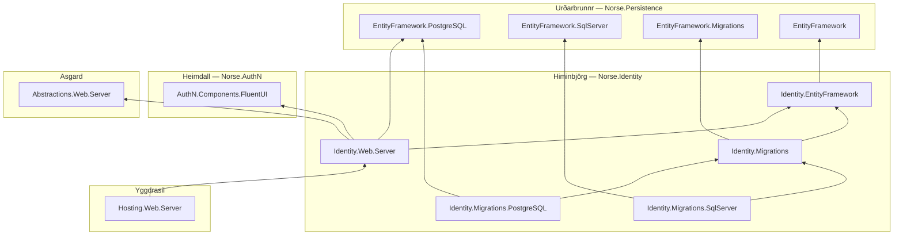

# Himinbjörg

> Himinbjörg — Heimdall's hall at the head of Bifröst.

<p align="center">
  
</p>

*Image credit: [@norsemythologyclips](https://www.instagram.com/norsemythologyclips/) — go follow them.*

The server-only identity store of the Norse Architecture, and — since PR #27 shipped `Identity.Web.Server` — its gRPC front door too: **`Norse.Identity.*`**, an EF Core model, conventions, migrations, and an `IAuthenticationService` implementation for ASP.NET Identity and OpenIddict. Entities and handlers stay server-side and never cross into WASM or MAUI — that boundary is load-bearing, not a convenience. In the dependency chain it rides on Urðarbrunnr's EF foundation and everything below, and it now also NorseRefs Heimdall's `AuthN.Components.FluentUI` — the `AuthN.Services` contract it implements arrives transitively through it, transitive-first by house law; Yggdrasil's `Hosting.Web.Server` rides on it in turn, via `AddNorseAuthenticationService`. The gRPC `AuthenticationService` is a bare `ISender` hydrate-and-send forwarder now — each method wraps Heimdall's pure wire DTO in a one-line server-sovereign command (`LoginCommand`/`RegisterCommand`/`EmailExistsCommand`/`LogoutCommand`, Asgard's `CommandRequest<TRequest,TResponse>`) carrying `[Authorize]`, since the wire records themselves carry no mediator marker at all. `LoginHandler`/`RegisterHandler`/`EmailExistsHandler`/`LogoutHandler` handle those commands and answer Asgard's shared wire shapes directly — `Outcome<NavigationResult>` for the issuance operations (one server-resolved `NextUrl` the client navigates unconditionally), `Outcome<BoolResponse>` for the existence check; no result record lives on either side of the wire. They never validate inline, and their registration (handlers, Asgard's generated validator adapters, dispatch-map entries) is compile-time generated by Asgard's `AddNorseIdentityWebServerHandlers()`, not hand-written.

**PII is protected at rest and erasable by design.** `NorsePersonalDataProtector` envelope-encrypts (AES-256-GCM) every column ASP.NET Core Identity marks `[ProtectedPersonalData]` (Email, PhoneNumber, UserName), keyed per subject via Asgard's key seam and a new `subject_keys` table; blind-index HMAC columns keep lookups working without ever comparing plaintext. `ErasureService.ShredAsync` is a three-act crypto-shred ceremony (null the lookup hashes, rotate the security stamp so live sessions die within one revalidation interval, destroy the per-subject key) — the payload ciphertext stays in place, permanently unreadable, and the caller gets back an `ErasureReceipt`. `Identity.Web.Server/Disclosure/IdentityService` implements Heimdall's `IIdentityService` disclosure contract (`Norse.AuthN.Services`, Task 19a) on top of the same seam: a subject can read their own personal data back in full, a system-role caller can read anyone's in masked form, and a shredded subject answers an honest `Erased` with the receipt — never a silent `NotFound`. Downloading your own personal data is now a gRPC call (`GetMyPersonalDataAsync`), materialized client-side by the ported `PersonalData.razor` page over on Heimdall; the old JSON-download scaffold endpoint here is gone, not deprecated.

**Identity is system-versioned (2026-08-05).** The eight tables carrying the durable identity and authorization record — `users`, `roles`, `user_claims`, `role_claims`, `user_roles`, `user_logins`, `applications`, `scopes` — declare Urðarbrunnr's `ITemporalEntity` marker, and that is the entire adoption: PostgreSQL gets the full apparatus (`system_period`, a `{table}_history` table under a `WITHOUT OVERLAPS` primary key, hardened `SECURITY DEFINER` triggers, and a `{table}_timeline` view) emitted by the chassis into an ordinary scaffolded migration, SQL Server gets EF-native `IsTemporal()`, and no hand-written SQL exists in this repo. `user_logins` is in deliberately — a third-party link that existed and was later disconnected is identity record worth keeping. Secret stores, counters, and prunable runtime state stay out just as deliberately: `user_tokens`, `user_passkeys`, `authorizations`, `tokens`, and `subject_keys` are never versioned, because a superseded secret must not survive in history and a temporal `DELETE` would preserve a wrapped key and make crypto-shredding reversible. One accepted rough edge until the `AccessFailedCount`/`LockoutEnd` split lands: wrong-password churn currently mints a history row on `users`.

## The dependency graph

Arrows point at the thing depended on. The gate and the hall depend on each other by design — Heimdall declares the contracts and pages, Himinbjörg implements and hosts them — which is why `Identity.Web.Server` sits above Heimdall's skin here while Heimdall's own chart shows this realm riding topmost.



Dependencies are transitive-first by house law — Heimdall's `AuthN.Services` contract reaches `Identity.Web.Server` through `AuthN.Components.FluentUI`, and Urðarbrunnr's base `EntityFramework` reaches it through `Identity.EntityFramework`, so no direct edges exist for either. Two of the NorseRefs also mount source generators (`Generator="true"`): Urðarbrunnr's `Persistence.EntityFramework` brings the entity-configuration generator into `Identity.EntityFramework`, and Asgard's `Abstractions.Web.Server` brings the registration generator that emits `AddNorseIdentityWebServerHandlers()`. `Identity.Web.Server` pins the PostgreSQL provider as its runtime provider; the migrations family stays deliberately two-provider.

## Status

**Live:** `Norse.Identity.EntityFramework`, `Norse.Identity.Web.Server`, `Norse.Identity.Migrations`, `Norse.Identity.Migrations.PostgreSQL`, and `Norse.Identity.Migrations.SqlServer` — the entity model and `NorseIdentityDbContext` sit in `Identity.EntityFramework`, a plain `Microsoft.NET.Sdk` library, so the migrations service reaches the schema without dragging the web hosting surface in behind it; `Identity.Web.Server` carries the gRPC `AuthenticationService`, the disclosure surface's `IdentityService` (`Disclosure/`), `NorseUserStore`, `NorseSignInManager`, the PII protection seam (`NorsePersonalDataProtector`/`NorseLookupProtector`/`ErasureService`), and the `/Account` + `/Account/Manage` Razor page scaffold still being weaned onto Heimdall's `AuthN.Components`/`AuthN.Components.FluentUI` component by component. The full ASP.NET Core Identity v3 + OpenIddict entity set, `NorseIdentityDbContext`, `NorseUserStore`, and a real EF migration (`InitialCreate`, checked in per-provider in `Identity.Migrations.PostgreSQL`/`.SqlServer`, temporal apparatus and all) stands up `norse_identity` end to end via the platform migrations service (the full story is on [Bifröst's README](https://github.com/NorseArchitecture/Bifrost#readme)). Identity was chosen as the proving vehicle for the whole migrations framework precisely because its schema is well-known and its base classes are unforgiving — if the framework survives ASP.NET Core Identity, it survives anything. Heimdall's auth surface now rides on this for real, tagged `v0.0.5` and consumed by Yggdrasil's `Hosting.Web.Server`; further curation (routes, remaining component moves) happens first via brainstorm → spec → plan, recorded in Glitnir's `docs/Himinbjorg/`.

## Migrations

```sh
dotnet tool restore
dotnet ef migrations add <Name> --project src/Identity.Migrations.PostgreSQL --startup-project src/Identity.Migrations.PostgreSQL
dotnet ef migrations add <Name> --project src/Identity.Migrations.SqlServer --startup-project src/Identity.Migrations.SqlServer
```

Both provider projects carry their own `IDesignTimeDbContextFactory`, so the commands above run fully offline — the design-time factory supplies an inert placeholder connection string and never opens a connection; actually applying migrations against a live database is the platform migrations service's job, not the CLI's. Every `migrations add`/`migrations remove` also auto-refreshes the embedded `schema/norse_identity.sql` DDL, regenerated by the platform's DDL-emitting scaffolder as part of the same command. Platform law keeps exactly one `InitialCreate` per provider until provider defaults settle — to change the schema, delete the provider project's `Migrations/` folder and re-add `InitialCreate` rather than stacking a second migration. Temporal enablement was squashed in exactly that way (2026-08-05): the eight ruled tables took `ITemporalEntity`, the folder was deleted, and `InitialCreate` was re-issued, so the apparatus now arrives at table birth with `CREATE TABLE` rather than as a bolted-on enable transition. This `InitialCreate` keeps being squashed in place on this branch, and is memorialized as the V1 schema only when .NET 11 preview 7's `SplitToTable` fix lands and the shape settles for good — `users` temporal, `user_lockout` split off and non-temporal.

## The cosmos

Himinbjörg is one realm of the [Norse Architecture](https://github.com/NorseArchitecture). The whole platform composes at [Bifröst](https://github.com/NorseArchitecture/Bifrost) — clone once, cross the bridge, and every session starts there so decisions get brainstormed across the entire landscape, not in isolation. Every design is tried in [Glitnir](https://github.com/NorseArchitecture/Glitnir), the design court, before code is forged here; this realm's specs and plans will live in the court's [docs/Himinbjörg/](https://github.com/NorseArchitecture/Glitnir/tree/master/docs/Himinbjorg) once they converge.

## Soundtrack: Himinbjörg
[](https://www.youtube.com/watch?v=clUFrvQ-a4U)
